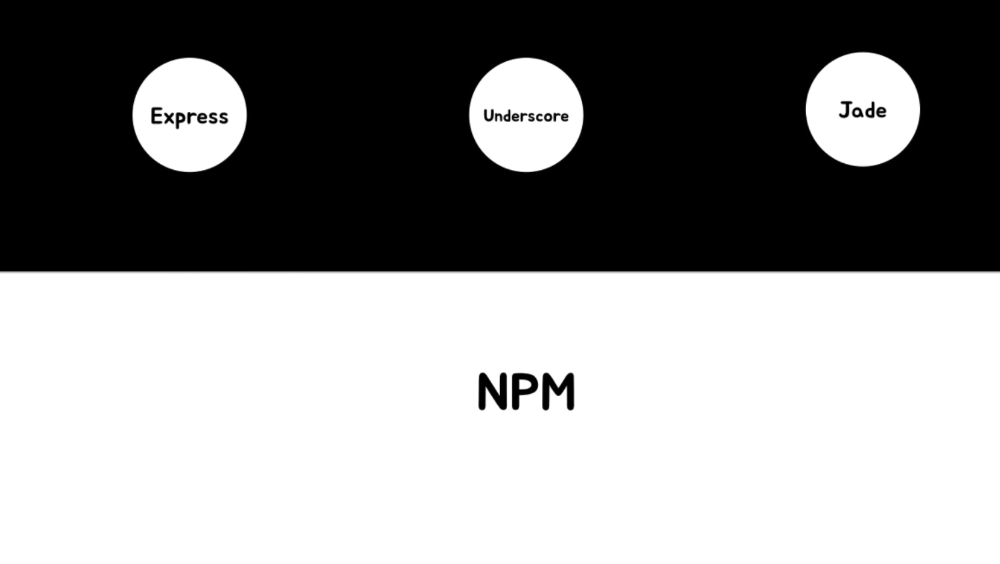

# OAuth2.0

   - 구글, 페이스북, 카카오 로그인을 구현한다.

노드 익스프레스 엔진으로 api 서버를 구축할때 보통 인증부분은 패스포트(passport) 모듈을 사용합니다. 클라이언트에서 이메일, 비밀번호를 리퀘스트 바디에 담아 서버로 인증요청을 하면 서버는 이를 확인해 인증된 클라이언트 정보를 세션에 저장을 하게 되는데 패스포트가 그 역할을 하는 것이죠. 한번 인증된 클라이언트는 서버에서 받은 세션 아이디를 쿠키 등에 저장해 놓고 있다가, 인증이 필요한 API를 호출할때 세션 아이디 정보를 함께 담아 요청하는 것이죠. 그럼 서버에서는 이전에 인증한 클라이언트로 보고 API 응답을 보내 주는 구조였습니다.

OAuth 2.0에는 엑세스 토큰(access token)을 사용합니다. 이 인증방법은 (1) 세션에 인증정보를 저장할 필요가 없습니다. 엑세스 토큰에 인증 정보가 있기 때문이죠. 서버에서는 이것을 디코딩하여 확인할 수 있습니다.  (2) 개발시 테스트도 편리합니다. 개발중 서버가 재구동되면 그 때마다 다시 로그인 프로토콜을 호출해야 하는 번거로움이 있죠. 그러나 OAuth 2.0을 사용하면 인증 후 획득한 엑세스 토큰을 헤더에 넣어서 호출하면 되기 때문에 개발시 매우 편리합니다.

   - 내일까지 알아보기
     클로저,스코프,프로미스 어싸인 어씽크

   NPM : 모듈들을 NPM을 통해서 우리의 어플리케이션에 담아서 다양한 형태의 에플리케이션을 만들어 낼 수 있다.
   Node Package Manager의 약자로 node.js에서 사용하는 모듈들을 패키지로 만들어 npm을 통하여 관리하고 배포하고 있다.

   node : 파일을 읽고 쓰는 FS, http, 운영체제 제어 OS (기본 제공)
   우리는 node.js라는 것으로 기본적인 기능들을 자바스크립트라는 프로그래밍 언어의 문법에 맞게
   결합해서 우리가 의도하는 바에 해당되는 프로그램을 만들어 내는 것이다.한번 프로그램을 만들면 
   언제든지 재사용이 가능하다. 이것이 가능한 이유는 노드.js가 기초적인 명령들을 제공하고 자바스크립트라는
   컴퓨터 프로그래밍 언어가 노드제이에스가 제공하는 명령들을 조합해서 새로운 명령들을 만들어 낼 수 있다.
   그렇게 만들어 낼수 있는 명령의 숫자는 어마어마하게 다양한 형태가 많다. 모듈과 npm을 제공한다.
    

   router : 라우터는 사용자의 접속을 요청을 어떤 컨트롤러에 전달을 해줄 것인가에 대한 중계자 역할을 한다.
   controller : (회원, 홈페이지, 에러화면 각각의 컨트롤러)우리는 라우터로 사용자의 요청을 처리한다.

   Javascript , NPM , Router 들을 연결해주는 것이 Node.js, Module, Controller 이다.

   - 추가 설명 
   미들웨어 :
   미들웨어는 양 쪽을 연결하여 데이터를 주고 받을 수 있도록 중간에서 매개 역할을 하는 소프트웨어, 네트워크를 통해서 연결된 여러 개의 컴퓨터에 있는 많은 프로세스들에게 어떤 서비스를 사용할 수 있도록 연결해 주는 소프트웨어를 말한다. 3계층 클라이언트/서버 구조에서 미들웨어가 존재한다. 웹 브라우저에서 데이터베이스로부터 데이터를 저장하거나 읽어올 수 있게 중간에 미들웨어가 존재하게 된다.

   - 출처 : http://wepla.net/?p=999
